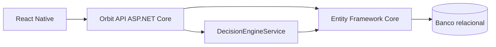
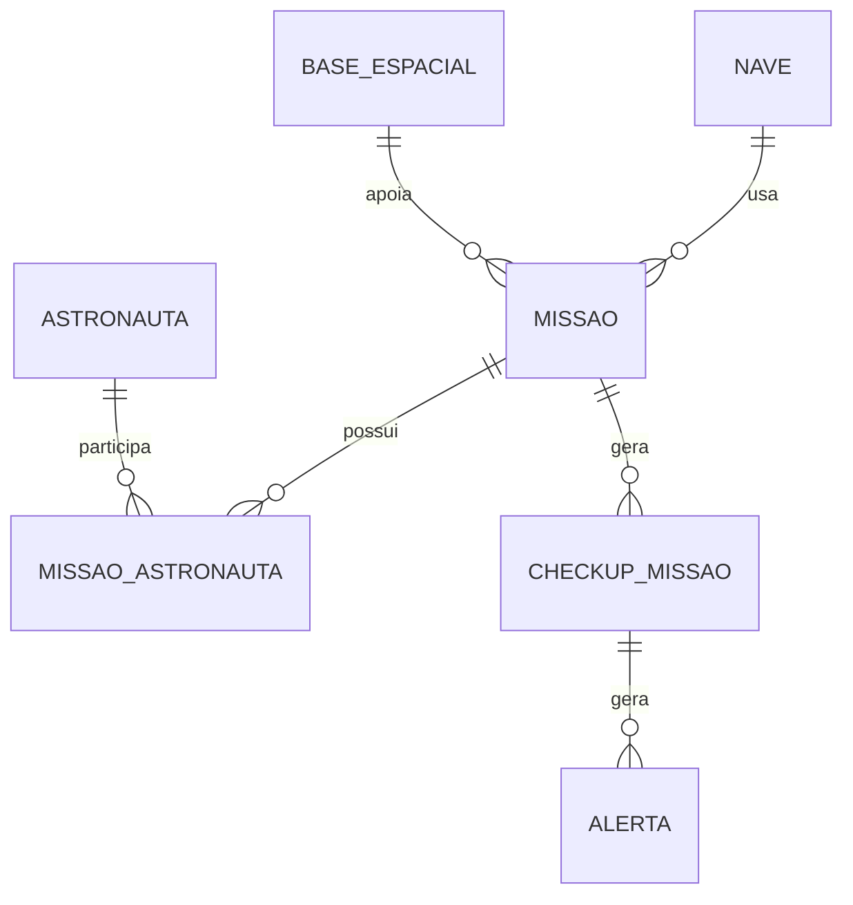

# Orbit API

Backend em ASP.NET Core para a Global Solution 2026/1.

O Orbit monitora astronautas, naves/rovers e bases espaciais para apoiar a decisao de continuidade de uma missao. A API calcula se a missao esta `Apta`, `EmAtencao` ou `Bloqueada` usando regras simples e auditaveis.
<br><br>
REPO: [LINK REPO GITHUB](https://github.com/mirellysousa/Orbit-API)<br>
PITCH: [LINK PITCH](https://youtu.be/2GcgGdJRse8?si=NtUkYi1OEIAizN2B)<br>
EXPLICATIVO DO PROJETO: [LINK EXPLICATIVO](https://youtu.be/haj9dt7Plvk)<br>

## Escopo do projeto

Esta versao mantem o projeto compacto, funcional e alinhado com a entrega de .NET:

- API REST com controllers;
- CRUD de astronautas, naves, bases e missoes;
- relacionamento entre missoes, naves, bases e astronautas;
- banco relacional com Entity Framework Core;
- migrations;
- endpoint de check-up da missao.


## Como rodar

### Recomendações
[1. Instalar .NET 10.0](https://dotnet.microsoft.com/pt-br/download/dotnet/10.0)
<br>
2. `Caso rode no VS Code:` Instalar as extensões: C#, C# Dev Kit e SQLite Viewer
<br>

```powershell
3. No terminal:
dotnet restore
dotnet run
```

## Documentacao da API

Com a API rodando, acesse a documentacao interativa pelo Scalar:

```text
http://localhost:5146/scalar
```

O documento OpenAPI em JSON tambem fica disponivel em:

```text
http://localhost:5146/openapi/v1.json
```

## Banco de dados

O banco padrao e SQLite local. Ele e criado automaticamente pelo Entity Framework Core com migrations quando a API inicia.

O arquivo do banco local se chama `orbit.db` e fica na raiz do projeto. Para visualizar as tabelas e registros, recomenda-se usar a extensao **SQLite Viewer** no VS Code:

1. Rode a API pelo menos uma vez com `dotnet run`.
2. Abra o arquivo `orbit.db` no VS Code.
3. Use o SQLite Viewer para navegar pelas tabelas.
4. Depois de fazer alteracoes pelo Postman, atualize/reabra a visualizacao do banco para ver os dados novos.

Tabelas principais:

```text
ASTRONAUTA
NAVE
BASE_ESPACIAL
MISSAO
MISSAO_ASTRONAUTA
CHECKUP_MISSAO
ALERTA
```

O Entity Framework tambem cria tabelas internas como `__EFMigrationsHistory`, usadas para controlar quais migrations ja foram aplicadas.

Se voce ja rodou uma versao anterior do projeto e aparecer erro de migration ou tabela ja existente, feche a API e apague o arquivo `orbit.db`. Ao rodar `dotnet run` de novo, o banco sera recriado automaticamente com a migration atual.

Para testar apenas se a API conectou no banco:

```http
GET /api/health/database
```

## Arquitetura



## Modelo relacional simplificado



## Endpoints principais

```text
GET    /api/dashboard
GET    /api/astronautas
POST   /api/astronautas
PUT    /api/astronautas/{id}
DELETE /api/astronautas/{id}

GET    /api/naves
POST   /api/naves
PUT    /api/naves/{id}
DELETE /api/naves/{id}

GET    /api/bases-espaciais
POST   /api/bases-espaciais
PUT    /api/bases-espaciais/{id}
DELETE /api/bases-espaciais/{id}

GET    /api/missoes
POST   /api/missoes
PUT    /api/missoes/{id}
DELETE /api/missoes/{id}

POST   /api/checkups/avaliar
GET    /api/checkups
GET    /api/checkups/missao/{missaoId}
GET    /api/alertas
```

## Testes manuais

Voce pode testar a API pelo Postman. O arquivo `Orbit.Api.http` tambem existe como alternativa para VS Code ou Visual Studio.

### Passo a passo no Postman

Com a API rodando em `http://localhost:5146`, crie uma Collection chamada `Orbit API` e adicione as requisicoes abaixo.

1. Testar banco:

```http
GET http://localhost:5146/api/health/database
```

2. Listar astronautas:

```http
GET http://localhost:5146/api/astronautas
```

3. Criar astronauta:

```http
POST http://localhost:5146/api/astronautas
Content-Type: application/json

{
  "nome": "Marina Costa",
  "funcao": "Medica de voo",
  "fadiga": 32,
  "hidratacao": 86,
  "oxigenacao": 98,
  "temperaturaCorporal": 36.6
}
```

O `id` retornado nessa resposta e o registro salvo no banco.

4. Buscar astronauta criado:

```http
GET http://localhost:5146/api/astronautas/{id}
```

5. Atualizar astronauta:

```http
PUT http://localhost:5146/api/astronautas/{id}
Content-Type: application/json

{
  "nome": "Marina Costa",
  "funcao": "Medica de voo",
  "fadiga": 45,
  "hidratacao": 80,
  "oxigenacao": 97,
  "temperaturaCorporal": 36.8
}
```

6. Deletar astronauta:

```http
DELETE http://localhost:5146/api/astronautas/{id}
```

7. Executar check-up de missao:

```http
POST http://localhost:5146/api/checkups/avaliar
Content-Type: application/json

{
  "missaoId": 1
}
```
## Criando uma missão com nave, base e astronautas

Antes de criar uma missão, é necessário ter cadastrado pelo menos:

- 1 nave;
- 1 base espacial, caso a missão tenha base de suporte;
- 1 ou mais astronautas.

Isso acontece porque a missão usa os IDs desses registros para criar os relacionamentos no banco.

### 1. Consultar os registros existentes

Para ver quais IDs podem ser usados na missão:

```http
GET http://localhost:5146/api/naves
GET http://localhost:5146/api/bases-espaciais
GET http://localhost:5146/api/astronautas
```

### 2. Criar uma missao

```http
POST http://localhost:5146/api/missoes
```
Body
```http
{
  "nome": "Reconhecimento Lunar",
  "objetivo": "Avaliar as condicoes da area para instalacao de novos equipamentos.",
  "destino": "Lua",
  "naveId": 1,
  "baseSuporteId": 1,
  "astronautaIds": [1, 2]
}
```
<br>
Nesse exemplo:

naveId: 1 liga a missão à nave de ID 1. <br>
baseSuporteId: 1 liga a missão à base espacial de ID 1. <br>
astronautaIds: [1, 2] liga a missão aos astronautas de ID 1 e 2. <br>

A relação entre missão e astronauta é N:N, ou seja:

uma missão pode ter vários astronautas;
um astronauta pode participar de várias missões.
Essa ligação é salva automaticamente na tabela intermediária `MISSAO_ASTRONAUTA`.

### 3. Criar missão sem base de suporte

Caso a missão ainda não tenha uma base de suporte definida, envie baseSuporteId como null:
Body:
```http
{
  "nome": "Patrulha Orbital",
  "objetivo": "Monitorar comunicacao e trajetoria orbital.",
  "destino": "Orbita terrestre",
  "naveId": 1,
  "baseSuporteId": null,
  "astronautaIds": [1, 2]
}
```
<br>
<br>
Quando voce usa o Postman, ele chama a API. A API usa o Entity Framework, e o Entity Framework altera o `orbit.db`. Portanto, um `POST` no Postman tambem faz um `INSERT` no banco; um `PUT` faz `UPDATE`; um `DELETE` remove o registro.

Fluxo recomendado para demonstracao:

1. Rodar `GET /api/dashboard`.
2. Rodar `GET /api/missoes`.
3. Criar um astronauta com `POST /api/astronautas`.
4. Conferir o registro no SQLite Viewer.
5. Atualizar o astronauta com `PUT /api/astronautas/{id}`.
6. Conferir a alteracao no SQLite Viewer.
7. Deletar o astronauta com `DELETE /api/astronautas/{id}`.
8. Rodar `POST /api/checkups/avaliar` com `missaoId = 1`.
9. Conferir os alertas em `GET /api/alertas`.

## Exemplo de check-up

```http
POST /api/checkups/avaliar
Content-Type: application/json

{
  "missaoId": 1
}
```

## Relacionamentos

- Uma missao usa uma nave.
- Uma missao pode ter uma base de suporte.
- Uma missao possui varios astronautas.
- Um astronauta pode participar de varias missoes.
- Um check-up pertence a uma missao.
- Um check-up pode gerar varios alertas.

## Regra de decisao

O `DecisionEngineService` avalia:

- fadiga, hidratacao, oxigenacao e temperatura dos astronautas;
- combustivel/bateria, temperatura, comunicacao e status da nave;
- oxigenio, agua, energia, medicamentos, pecas e status da base.

Resultado:

- `Apta`: sem alertas importantes;
- `EmAtencao`: alertas moderados ou risco intermediario;
- `Bloqueada`: alerta critico ou risco alto.
